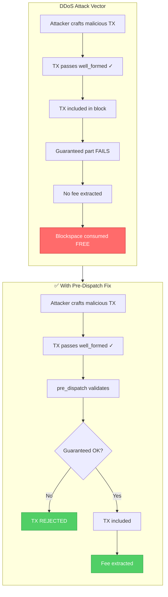
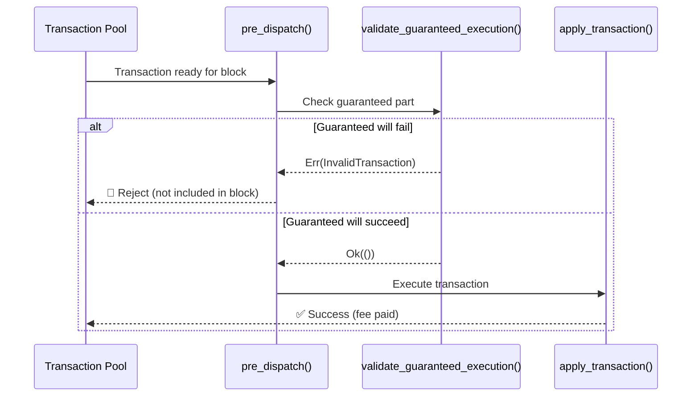

# Pre-Dispatch Validation of Guaranteed Transaction Part

#### status: accepted
#### date: 2025-12-12
#### deciders: TBD

## Context and Problem Statement

Midnight transactions have a two-phase execution model:
1. **Guaranteed part** - Always executes; fees are extracted here
2. **Fallible part** - May succeed or fail; failure is acceptable

A DDoS vulnerability exists where transactions can pass structural validation (`well_formed()`) but fail during guaranteed execution. When this happens:
- The transaction is included in the block (consumes blockspace)
- The guaranteed part fails before fees are extracted
- **Result:** Blockspace consumed, zero fees paid

An attacker can exploit this by flooding the network with structurally valid transactions designed to fail the guaranteed part, filling blocks without paying fees.

#### DDoS Attack Vector

**Ticket:** [PM-20944](https://shielded.atlassian.net/browse/PM-20944)

## Decision Drivers

* Transactions that fail the guaranteed part consume blockspace without paying fees
* This creates a DDoS attack vector where attackers can fill blocks at no cost
* Current validation (`well_formed()`) only checks structural validity, not semantic validity
* The `pre_dispatch` hook is underutilized (currently just re-runs `validate_unsigned`)

## Considered Options

1. **Enhanced `pre_dispatch` validation** - Add semantic validation of guaranteed part before block inclusion
2. **Substrate-level base fee** - Charge a minimum fee via Substrate's fee mechanism before ledger execution
3. **Dry-run in pool validation** - Simulate guaranteed execution during `validate_unsigned`
4. **Move fee extraction first** - Restructure ledger to extract fees before guaranteed execution
5. **Block builder hints** - Advisory system for block authors to filter problematic transactions

## Decision Outcome

Chosen option: **"Enhanced `pre_dispatch` validation"**, because it:
- Catches failures at the correct point (block building, not pool entry)
- Uses current block state for validation (not stale pool validation state)
- Requires minimal changes to ledger architecture
- Follows existing Substrate patterns

### Implementation

1. Add `validate_guaranteed_execution` function in ledger that simulates guaranteed part execution without modifying state
2. Expose this through the Bridge API
3. Enhance `pre_dispatch` in the midnight pallet to call this validation
4. Reject transactions at block building time if guaranteed part would fail

#### Solution Flow

### Positive Consequences

* Transactions with failing guaranteed parts are rejected before block inclusion
* Attackers cannot fill blocks without paying fees
* Minimal impact on existing transaction processing flow
* Uses existing Substrate hook (`pre_dispatch`)

### Negative Consequences

* Slight performance overhead (guaranteed part validated twice for successful transactions)
* Edge case: state could change between `pre_dispatch` and `apply` (handled by existing error path)

## Validation

Measurable outcomes:

- Attack simulation test: 100% of failing-guaranteed transactions rejected before block inclusion
- Performance: Block building time impact < 10%
- No regressions in existing transaction processing

## Pros and Cons of the Options

### Enhanced `pre_dispatch` validation

* Good, because it uses current block state (accurate validation)
* Good, because it's the correct point in the pipeline
* Good, because minimal changes to ledger architecture
* Neutral, because some work duplication (validate + apply)
* Bad, because small performance overhead

### Substrate-level base fee

* Good, because simple implementation using existing Substrate infrastructure
* Bad, because changes economic model of the chain
* Bad, because still wastes blockspace (transaction included, then fails)
* Bad, because requires account abstraction for fee payment

### Dry-run in pool validation

* Good, because catches failures earlier in pipeline
* Bad, because uses stale state (pool validation may happen long before block)
* Bad, because expensive to run for every pool entry

### Move fee extraction first

* Good, because fundamental fix to the root cause
* Bad, because major ledger architecture change
* Bad, because high risk of breaking existing functionality
* Bad, because high implementation effort

### Block builder hints

* Good, because low coupling with existing code
* Bad, because advisory only (doesn't prevent determined attackers)
* Bad, because requires changes to block authoring logic

